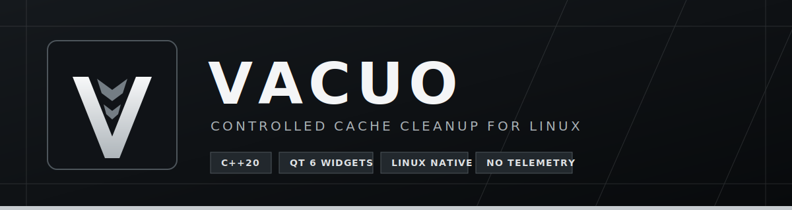

<p align="center">
  
</p>

<p align="center">
  <a href="README.md"></a>
  <a href="https://github.com/Trendorin/Vacuo/releases"></a>
  <a href="SECURITY.md"></a>
</p>

Vacuo — нативное Linux-приложение для контролируемой очистки кэша: C++20 backend и интерфейс на Qt 6 Widgets. Оно сначала сканирует систему, показывает точный план и предупреждения, а затем очищает только выбранные категории. Без Electron, телеметрии, аккаунта, облака и фонового демона.

## Основное

| Нативный интерфейс | Явный выбор | Минимум root-кода |
|---|---|---|
| Обычные Qt Widgets, системная рамка окна, палитра и тема рабочего стола. | Размеры, риски, описание каждой категории и финальное подтверждение. | GUI не работает от root. PolicyKit helper принимает фиксированные действия, а не пути или shell-команды. |

Vacuo не навязывает собственную тему. KDE Plasma, GNOME, Xfce, Cinnamon, LXQt и Wayland-композиторы оформляют приложение через системный стиль Qt.

## Что очищается

| Категория | По умолчанию | Что сохраняется |
|---|:---:|---|
| Общий кэш приложений | Вкл. | Настройки и данные в `~/.config` / `~/.local/share` не затрагиваются. |
| Миниатюры | Вкл. | Исходные файлы остаются; превью создаются заново. |
| Кэш браузеров | Выкл. | Профили, история, cookies, пароли и расширения не являются целями. |
| Кэш разработки | Выкл. | Исходники проектов не затрагиваются; зависимости могут скачаться повторно. |
| Кэш Flatpak-приложений | Выкл. | Очищается только `~/.var/app/<id>/cache`. |
| Кэш Steam | Выкл. | Игры, сохранения и настройки остаются; шейдеры могут пересобраться. |
| Корзина | Выкл. | Удаление необратимо. |
| Пакеты, journal, coredump, Snap | Выкл. | Каждое системное действие выбирается отдельно и требует PolicyKit. |

Поддерживаются семейства Fedora/RHEL, Arch, Debian/Ubuntu, openSUSE и Alpine. На неизвестной системе Vacuo включает только безопасные пользовательские XDG-правила и не угадывает команду пакетного менеджера.

## Безопасность

- GUI и CLI не выполняют очистку от root.
- Пути задаются в скомпилированном allow-list; поля для произвольного каталога нет.
- `/`, домашняя директория, `~/.config`, `~/.local` и общие каталоги данных защищены.
- Цель должна быть реальной директорией пользователя; symlink в любом компоненте пути блокируется.
- Удаление выполняется через `openat` / `fstatat` / `unlinkat` с no-follow-флагами.
- Helper не setuid и запускается PolicyKit только для системных действий.
- Helper принимает четыре фиксированных идентификатора, не вызывает shell и использует абсолютные пути команд.
- Для Arch нужен `paccache`; опасного fallback на `pacman -Scc` нет.

Подробности: [модель безопасности](docs/SECURITY_MODEL.md), [приватность](docs/PRIVACY.md), [сообщение об уязвимостях](SECURITY.md).

Кэш удаляется окончательно. Перед очисткой проверь категории и закрой затронутые приложения.

## Установка

Готовые `.rpm`, `.deb`, исходный архив, `PKGBUILD`, контрольные суммы и SPDX SBOM находятся в [релизах](https://github.com/Trendorin/Vacuo/releases/latest).

Fedora:

```bash
sudo dnf install ./vacuo-*.rpm
```

Debian / Ubuntu:

```bash
sudo apt install ./vacuo_*.deb
```

Arch: скачайте `PKGBUILD` и архив исходников из одного релиза, проверьте их и выполните:

```bash
makepkg -si
```

Для очистки кэша pacman установите `pacman-contrib`.

### Сборка

Нужны C++20, CMake 3.24+, Ninja или Make, Qt 6.4+ с модулями Widgets/Concurrent и PolicyKit для системных действий.

```bash
git clone https://github.com/Trendorin/Vacuo.git
cd Vacuo
cmake -S . -B build -G Ninja \
  -DCMAKE_BUILD_TYPE=Release \
  -DCMAKE_INSTALL_PREFIX=/usr
cmake --build build --parallel
ctest --test-dir build --output-on-failure
sudo cmake --install build
```

Нельзя добавлять helper-файлу setuid/setgid.

## CLI

```bash
vacuoctl system
vacuoctl list
vacuoctl scan --json
vacuoctl clean --category thumbnails --category application-cache --yes
```

Неявной команды `clean all` нет специально.

## Разработка

Core не зависит от Qt и проверяется отдельно:

```bash
./tests/run-core-tests.sh
```

Полная сборка проходит CI на Ubuntu, Fedora и Arch; отдельно работают ASan/UBSan и CodeQL. Правила для новых категорий описаны в [CONTRIBUTING.md](CONTRIBUTING.md).

Проект поддерживает [Trendorin](https://github.com/Trendorin). Реальные участники видны в [истории Git](https://github.com/Trendorin/Vacuo/graphs/contributors); фиктивный список contributors не используется.

Лицензия: [GNU GPL v3 или новее](LICENSE).
